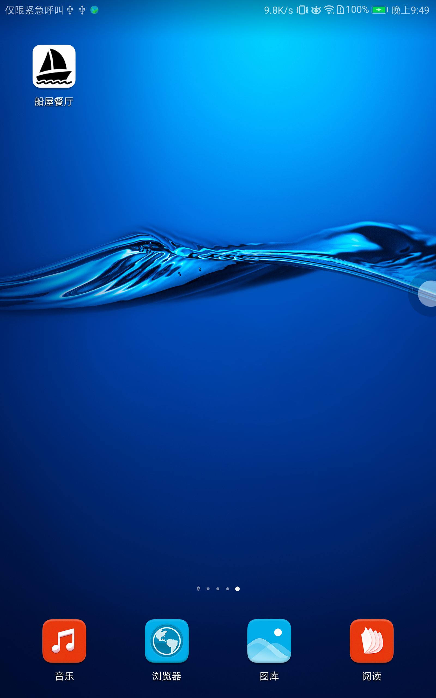
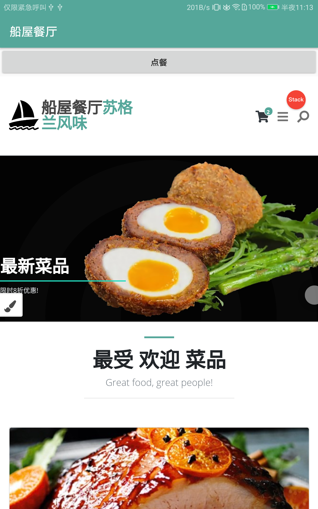
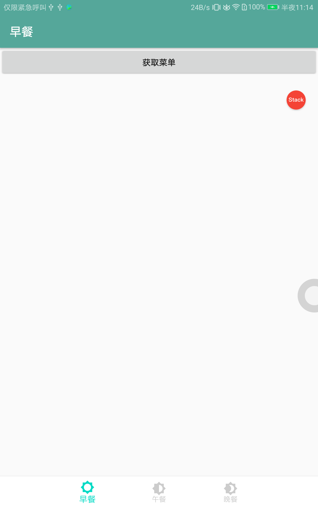
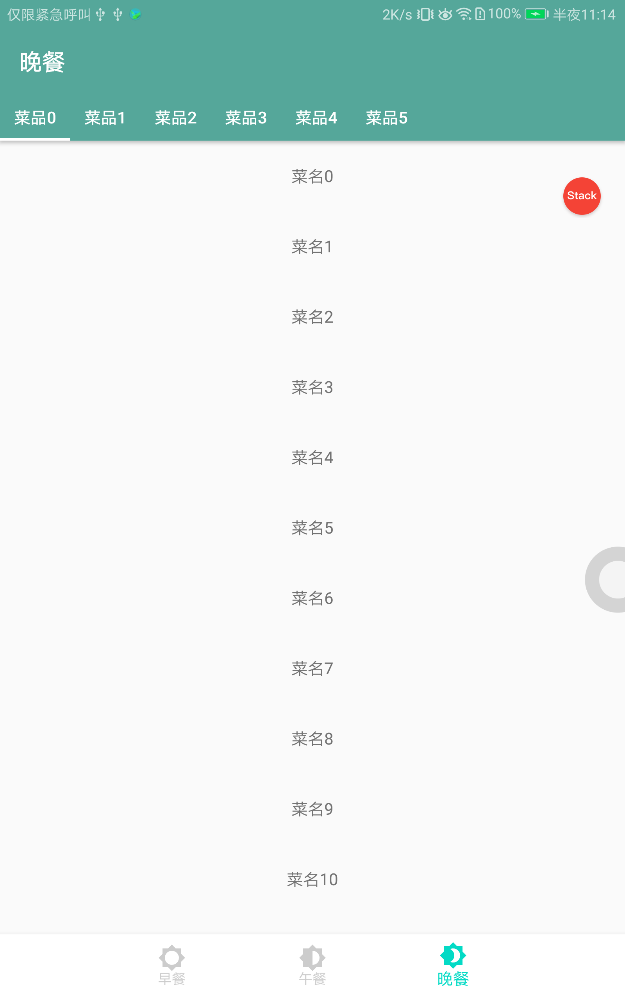
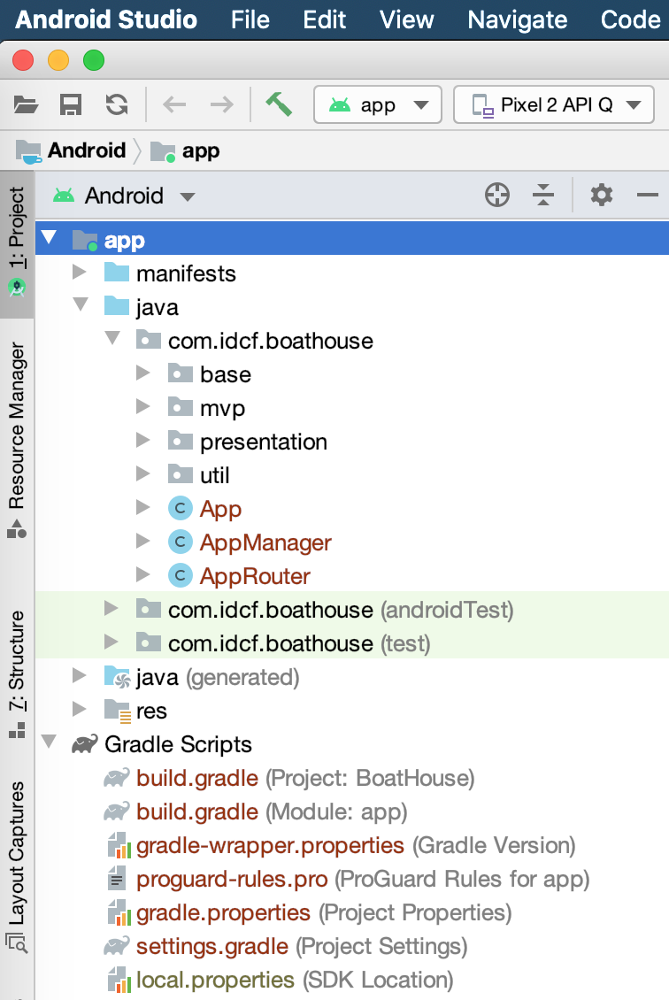

# boat-house 船屋餐饮系统移动端(Android)

## IDCF Boat House 移动端 介绍

通过此移动端App，可使用手机浏览菜品，自助点餐等。

## 系统架构 

安卓原生app, 基于MVP架构开发。

## 现有功能

* Fragment.
* WebView.
* MVP.

## Logo && 预览

 |  | 

## 开发环境

Android Studio

* Gradle版本:3.6.1

## 目录介绍

#### `.github`: github action 流水线

#### `devops`: 自动化相关目录，如jenkins流水线

#### `test`: 单元测试和自动化测试

#### `boat-house-android-proj` Andorid studio 项目目录

#### 代码目录结构

`boat-house-android-proj\app\src\main\java\com\idcf\boathouse`

* base Activity & Fragment Base类
* mvp MVP的Base类都在这里面
* presentation 主要包，其中的Contract类是定义View和Presenter接口的地方
* util 通用工具包
* App Application
* AppRouter App路由，界面跳转帮助类，所有的界面跳转通过此类进行跳转,包括组件交互

## 开发/调试环境配置

#### 开发环境

### Windows

- 配置java开发环境
- 安装 Android Studio， 下载地址：http://www.android-studio.org/
- 打开Android Studio，打项目：
- 
## DevOps

## 测试

## 常见问题